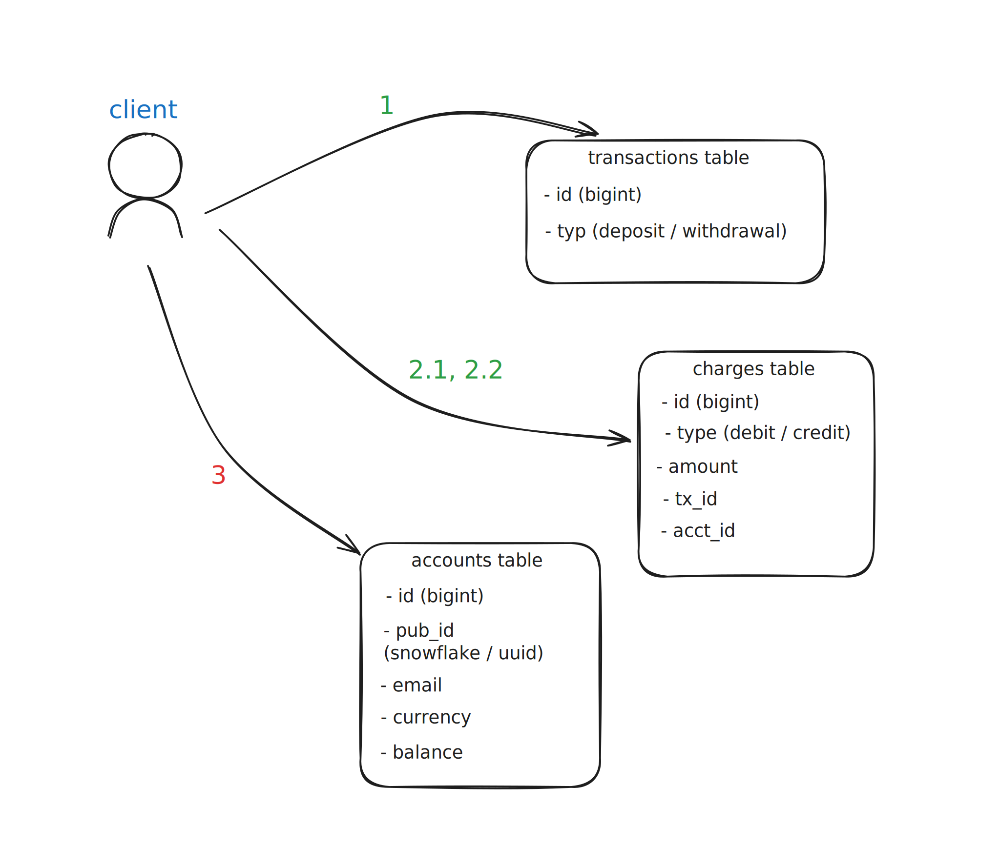

# Bankxgo

A simple banking API code exercise in Go.

## REST API
The API supports the following endpoints for handling account operations:

### Create Account
Endpoint: `POST /accounts`  
Description: Creates a new account with a specified currency and email address.  
Request Body:  
```json
{
    "email": "arhyth@gmail.com",
    "currency": "USD"
}
```
Response:
`201` Created with the details of the newly created account.  
```json
{
    "acctId": "1833751339268609975"
}
```
`400` Bad Request if the currency is unsupported or the email is invalid.  
`409` Conflict if an account with the same email already exists.  

### Withdraw Funds
Endpoint: `POST /accounts/{acctId}/withdraw`  
Description: Withdraws a specified amount from the user's account.  
Request Header: `email: user@email.com`  
Request Body:  
```json
{
    "amount": 100.0
}
```
Response:  
`200` OK on success.  
```json
{
    "balance": 200.0
}
```
`400` Bad Request if the amount exceeds the available balance.  
```json
{
    "fields": {
        "amount": "insufficient balance"
    }
}
```
`404` Not Found if the account is not found.
```json
{
    "id": 123456789
}
```

### Deposit Funds
Endpoint: `POST /accounts/{acctId}/deposit`  
Description: Deposits a specified amount into the user's account.  
Request Header: `email: user@email.com`  
Request Body:  
```json
{
    "amount": 200.0
}
```
Response:  
`200` OK on success.  
```json
{
    "balance": 300.0
}
```
`400` Bad Request if the amount is invalid.  
```json
{
    "fields": {
        "amount": "cannot be negative"
    }
}
```
`404` Not Found if the account is not found.  
```json
{
    "id": 123456789
}
```

### Generate Statement of Account (SOA)
Endpoint: `GET /accounts/{acctId}/statement`  
Description: Generates and returns a Statement of Account (SOA) for the specified account.  
Request Header: `email: user@email.com`  
Response:  
`200` OK with a PDF containing the transaction history.  
`404` Not Found if the account is not found.  

### View Balance
Endpoint: `GET /accounts/{acctId}/balance`  
Description: Retrieves the current balance of the user's account.  
Request Header: `email: user@email.com`  
Response:  
`200` OK with a JSON object containing the account balance.  
```json
{
    "balance": "123.45"
}
```
`404` Not Found if the account is not found.
```json
{
    "id": 123456789
}
```

## Local Development
1. Spin up a fresh Postgres database instance however you like
2. Configure database connection string appropriately, see [`config.yml`](config.yml)
3. Set up system accounts for each currency to be supported. Input valid Snowflake ID for each. You can grab some outputs from any online snowflake ID generator. Also, see [`config.yml`](config.yml).
4. Build [`cmd/seeder/main.go`](cmd/seeder/main.go) and run it. This should create system accounts for the entries you configured in `config.yml`.  
```sh
go build -o seeder cmd/seeder/main.go
./seeder --config=config.yml
```
5. Build [`cmd/server/main.go`](cmd/server/main.go) and run it.  
```sh
go build -o seeder cmd/seeder/main.go
./server --config=config.yml
```
6. Profit! (maybe)  
Create an account.  
```sh
curl -X POST http://localhost:3000/accounts/ \
-H "Content-Type: application/json" \
-d '{"email": "boy@bawang.com", "currency": "PHP"}'

{"acctID":"1836378168910905344"}
```
Keep some moolah.  
```sh
curl -X POST http://localhost:3000/accounts/1836378168910905344/deposit \
-H "Content-Type: application/json" -H "email: boy@bawang.com" \
-d '{"amount": 800}'

{"balance":"800"}  
```
&nbsp;&nbsp;&nbsp;&nbsp;Check your bizniz!  
```sh
curl -H "email:boy@bawang.com" -o fetched.pdf http://localhost:3000/accounts/1836378168910905344/statement

  % Total    % Received % Xferd  Average Speed   Time    Time     Time  Current
                                 Dload  Upload   Total   Spent    Left  Speed
100  1735  100  1735    0     0   110k      0 --:--:-- --:--:-- --:--:--  338k
```


## Notes
### Data Model | Architecture

1. Uses debit/credit book keeping
2. Requires a seed of system account record for each currency supported; however, the balance of these accounts are not checked for every transaction since that would easily cause a bottleneck, ie. the system account is debited / credited correspondingly for each user deposit / withdrawal. Think user-to-user transfers but one of the users is always the system.
3. Instead, the user account balance will be used to enforce invariant (should not be allowed to withdraw to below zero). The system accounts can be monitored for consistency by some other external process albeit in “soft-time”. I believe this is a good enough trade off.
4. Transaction involves following steps:
 4.1 Insert a transaction record
 4.2 Create corresponding records on charges table, one for the user account
 4.3 another for the system account;
 4.4 Lock user account record and update balance
5. Explicit locking is used to avoid excessive transaction aborts in case of heavy contention.
6. The `transactions` table does not improve safety/consistency of the system. It is simply a means to improve “auditability” as it ties charge records together. 
7. The invariant-keeping logic is intentionally pushed to the database to keep the service (instances) stateless and simple. I believe this is a good enough design without having to involve an external queue or write some haphazard internal version of it for coordination and load buffering.

### Miscellaneous
1. No load testing done, unfortunately.
2. so... the ratelimiter middleware is merely decoration :D
3. Speaking of testing, tests involving the database, ie., `postgres_test.go` is separated using build tag `integration`.
```sh
BANKXGO_TEST_CONFIG=testdata/config.yml go test -tags integration
```
4. No technical reason for choosing Postgres as the data store other than it's the one I'm most familiar with.


## To Do
- [x] deposit method and endpoint  
- [x] tests  
- [x] tests
- [x] withdraw method and endpoint  
- [x] tests  
- [x] balance method and endpoint  
- [x] tests  
- [x] statement method and endpoint  
- [x] middleware rate limiter
- [ ] tests  
- [x] middleware for input validation 
- [x] tests  
- [x] configuration for system accounts  
- [ ] tests  
- [ ] tests  
